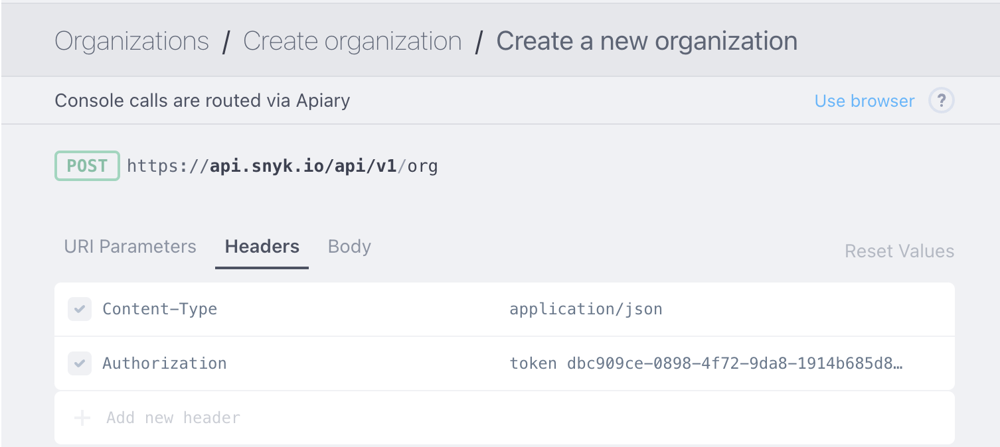
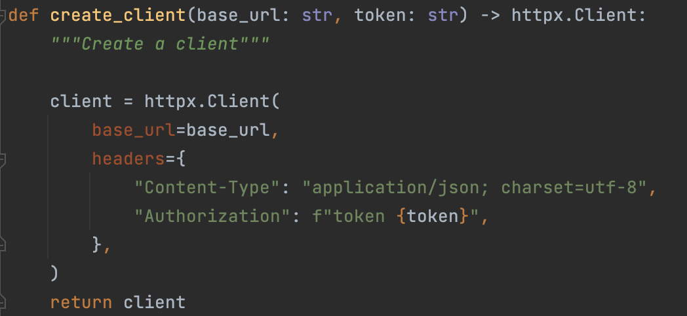
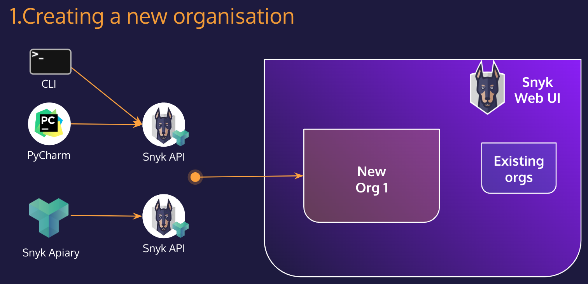
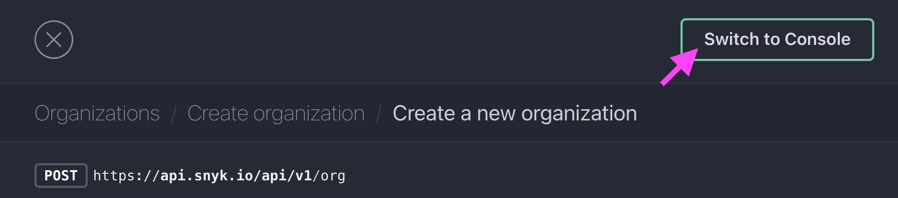
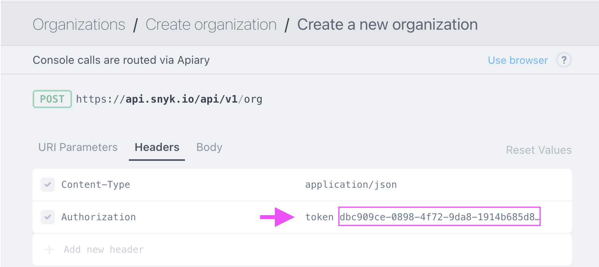
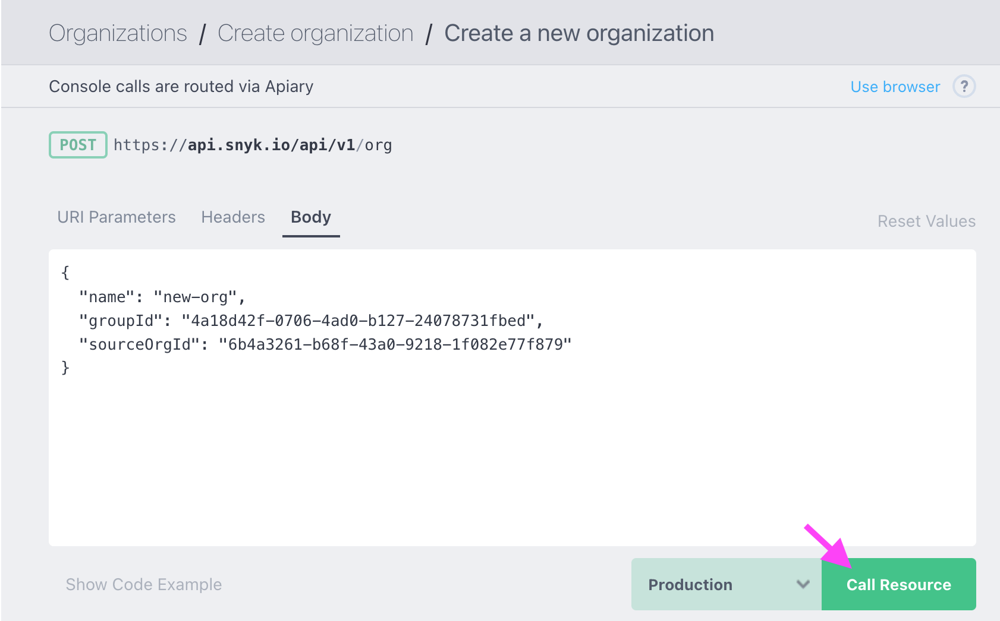
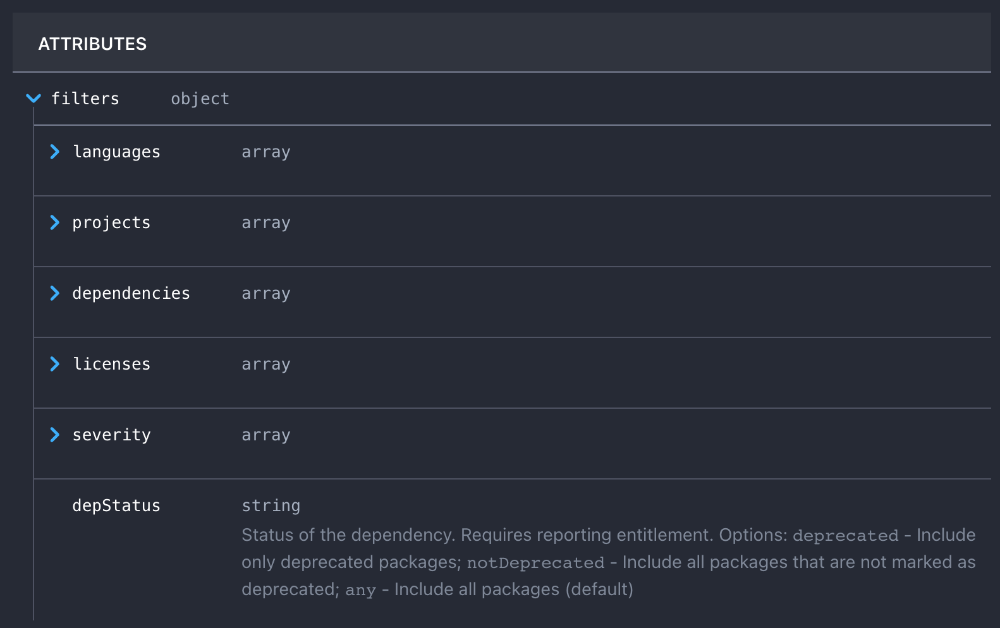
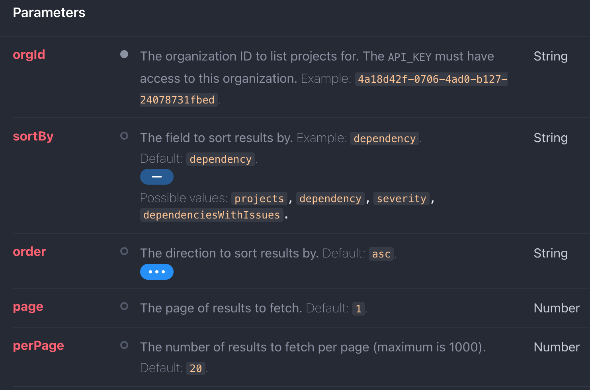

# Hands-on workshop: Interacting with the Snyk API by using Python-scripts and apiary.io 
   
There are many ways to interact with the Snyk API. 
We will be using [apiary.io](https://snyk.docs.apiary.io/#reference/organizations/create-organization/create-a-new-organization) and Python-scripts now.
   
- Seb Roth held a [workshop](https://github.com/mcsnyk/Seb-snyk-api-workshop) on how to interact with the pysnyk API Client (Small Hands, Windsor 2022).   
There are many language-specific Snyk API Clients Libraries available:   
 		- Python [client library](https://github.com/snyk-labs/pysnyk) for Snyk  
 		- JavaScript [client library](https://github.com/JupiterOne/snyk-client) for Snyk  
 		- Go [client library](https://github.com/picatz/snyk) for Snyk  
 		- PHP [client library](https://github.com/navikt/snyk-api-php-client) for Snyk   
 		- Ruby [client library](https://github.com/edgar/rsnyk) for Snyk   
  
- Rotem Miara also held a [workshop](https://docs.google.com/document/d/1Ux2-DSLSnBaS33OrAXyYzwNkwOkpkh0Sr8l4tTHyXgU/edit) on how to onboard projects in the Snyk Web-UI.
    
## Plan for the workshop
- [1. Authentication](#1-authentication)<br/>
- [2. Creating a new organisation in the Snyk webUI](#2-creating-a-new-organisation-in-the-snyk-webui)<br/>
	- [2.a. Creating a new organisation using apiary.io](#2a-creating-a-new-organisation-using-apiaryio)  <br/>
	- [2.b. Creating a new organisation using httpx and Python](#2b-creating-a-new-organisation-using-httpx-and-python)  <br/>
- [3. List all organisations within your Snyk Group](#3-list-all-organisations-within-your-snyk-group)  <br/>  
- [4. Add a new integration to an organisation](#4-add-a-new-integration-to-an-organisation)  <br/>
- [5. Moving projects to different organisations](#5-moving-projects-to-different-organisations)  <br/>
- [6. Dependencies of an organization](#6-dependencies-of-an-organization)  <br/>
- [7. List the used Open Source licences in a project of an organization](#7-list-the-used-open-source-licences-in-a-project-of-an-organization)  <br/>
- [8. The reporting-API](#8-the-reporting-api)  <br/>

## Preamble
- [ ] Clone this repo to your machine by using ```git clone <https...>```
- [ ] You can execute a Python3 file by using ```python3 <name of the file.py>```

## 1. Authentication  
Before we can do things with the API, we need to **authenticate** first, because the API needs to know who it is interacting with, and what permissions are assigned to us (what we are allowed to do).

The authentication happens in form of a **handshake** which means we have to send the following information to the Snyk API first.



or in form of a Python3 code, where we'll use an httpx client, we need to authenticate first: ```snyk auth``` <br/><br/>


## 2. Creating a new organisation in the Snyk webUI


### 2.a. Creating a new organisation using [apiary.io](https://snyk.docs.apiary.io/#reference/organizations/create-organization/create-a-new-organization) 
- [ ] Go to [apiary.io](https://snyk.docs.apiary.io/#reference/organizations/create-organization/create-a-new-organization) and click on "Switch to console"<br/>


- [ ] Now we need to configure the Header-first. For now, we only change the "Authorization" field by adding a valid token to it (replace the text **API_KEY** to a valid **Group-level-token**)<br/>   


- [ ] Change the parameters in the Body-section: the name of your new organisation in the Snyk WebUI, your GroupID in the Snyk WebUI, and **optionally** an organisationID from the Snyk WebUI where we can copy the various integrations-settings from.

- [ ] Click on the green button "Call Resources" <br/>


- [ ] Take a look at the Response box below and try to understand what has happened.
- [ ] Go to your Snyk WebUI and check if the new organisation is there.   
<br/>

### 2.b. Creating a new organisation using httpx and Python
---
:genie: Use the file **create-new-orgs.py**

---
Let's create a new organisation in your Snyk Group using the Snyk API.
In this case we are going to use a fully featured HTTP client for Python3, called [httpx](https://www.python-httpx.org/). <br/>

As mentioned above, the authentication starts with a TCP-handshake. If we didn't use a client (which keeps a connection active and alive), we would have to do this handshake every single time we leverage the various API functions and call the API. A client also allows us to have multiple connections at the same time by reducing overhead operations at a networking level.

- [ ] Please check if Python3 is installed on your machine by running the command (any version above 3.5 should be fine): <br/>
```python3 --version```
- [ ] First of all, we need to install the Python libraries needed (requirements.txt) <br/>
```pip3 install -r requirements.txt``` <br/>

Normally, we should create a virtual environment at the beginning, set environment variables as secrets (Snyk Tokens, Group IDs, Org. IDs...). 
Now we we'll use these secrets in a hard-coded way as regular Python variables.

- [ ] After giving values to the **SNYK_TOKEN**, **GROUP_ID** and **NEW_PROJECT_NAME** variables, run the script:
```python3 create-new-orgs.py```

- [ ] Take a look at the response of the API and try to understand what has happened.
- [ ] Go to your Snyk WebUI and check if the new organisation is there. 
<br/>

## 3. List all organisations within your Snyk Group
---
:genie: Use the file **get-all-orgs-in-group.py**

---
Besides, check if the ID of the newly created organisation is the same, as in 2.a or 2.b

- [ ] Fill in the SNYK_TOKEN, GROUP_ID and name_splinter
- [ ] Take a look at the results, compare them with what you see [in Apiary!](https://snyk.docs.apiary.io/#reference/groups/list-all-organizations-in-a-group/list-all-organizations-in-a-group)

This way we can filter orgs to e.g. when they were created 
`the format is like "created": "2022-08-07T16:14:57.231Z")`, etc... 
- Get the ID's of all in August created orgs:
```
splinter = "-08-"

for org in group_orgs:
   if splinter in org["created"]:
      print(org["id"])
```

## 4. Add a new integration to an organisation
---
:genie: Use the file **list-add-new-integration.py** <br/>
:fire: Please choose a repository from an SCM (or CR) where there are projects that you can import

---
- [ ] First of all, let's check, which are the existing integrations! You can choose an existing Snyk-org with multiple integrations. Give values to the **SNYK_TOKEN** and **ORG_ID** variables!

Now we are creating a new integration!
- [ ] Let's check, [what parameters are needed](https://snyk.docs.apiary.io/#reference/integrations/integrations/add-new-integration) to establish a new connection to an SCM or CR. The various integrations require also various parameters to be configured (e.g. username + password, url, token, etc...)

In my example, I'll create a Gitlab connection, the integration parameters should look like this:
```
    new_integration_data = {
        "type": integration_type,
        "credentials": {
            "token": integration_token,
            "url": gitlab_url
        }
    }
``` 

**Import a vulnerable application!**

## 5. Moving projects to different organisations
---
:genie: Use the file **move-projects.py** <br/>

---
Let's see first, [what parameters are needed](https://snyk.docs.apiary.io/#reference/projects/move-project/move-project-to-a-different-organization) in order to move a project from one org into another.   

- [ ] Choose a project (e.g. a Terraform file, a manifest file, etc.) that we well move to one of your existing orgs!
- [ ] In the file **move-projects.py** set the prijectID of the file, the source orgID and the target orgID!

- [ ] Choose a project (e.g. a Terraform file, a manifest file, etc.) that we well move to one of your existing orgs!
     
Note: 
- both organisations (origin and target) must have integrations to the same SCM, CR...
- in the Python script we used a PUT command instead of a POST, GET or DELETE...    


## 6. Dependencies of an organization
---
:genie: Use the file **get-org-dependencies.py**

---
- When getting all the dependencies of a given organisation, we are going to **use different filter attributes**. By doing so, we'll get only the relevant data from the API, it makes it easier for us to identify what we are looking for from reporting.      
- We could require all the information from the API and then retrieve the relevant pieces by filtering, sanitizing, etc. them, but it may cause a huge overhead, costs... It is rarely the best way or solution to move an entire database.

- [ ] Let's take a look at the [different filter attributes](https://snyk.docs.apiary.io/#reference/dependencies/dependencies-by-organization/list-all-dependencies) first!


- [ ] Let's create filter attributes! Filter out C and H severity dependencies in Javascript and Terraform files, in a given project! 
```
    filters = {
        "filters": {
            "languages": ["javascript", "terraform"],
            "projects": ["f5b58850-b885-4690-838c-5b1165f0b21e"],
            "severity": ["critical", "high"]
        }
    }
```

- [ ] **Experiment with the filtering**! Also try to use the [sorting and grouping options](https://snyk.docs.apiary.io/#reference/dependencies/dependencies-by-organization/list-all-dependencies)!



## 7. List the used Open Source licences in a project of an organization
---
:genie: Use the file **get-licences.py**

---
In this chapter we'll see, how we can retrieve Open Source licences from orgs or projects [via the Snyk API](https://snyk.docs.apiary.io/#reference/licenses/licenses-by-organization/list-all-licenses).
Let's use an organisation this time where there are at least 2 Open Source projects!

- [ ] List all the Open Source licences used by some projects of a given org!
- [ ] Choose one with multiple licences and assign the string to the variable __chosen_double_license__! Run the second part of the script and observe the **severity** of that license!  

## 8. The reporting-API
---
:genie: Use the files **reporting-latest-issues.py** and **get-issue-counts.py**

---
### Reporting the latest issues:
Returns issues currently in existence. This data can take up to 9 hours to refresh.   

Now we will take a look at how the [reporting API](https://snyk.docs.apiary.io/#reference/reporting-api/latest-issues/get-list-of-latest-issues) works.

Let's try to list all the 
- [ ] **:fire: set the orgID** (required parameter) :fire:
- [ ] **C** severity
- [ ] **vulnerabilities** ("vulns"),
- [ ] where the exploit maturity **"mature"** or **"proof-of-concept"** is, 
- [ ] the priority score **between 312 and 876** lies, 
- [ ] **not ignored** (== active) issues, 
- [ ] apply it **for a given project** (you can choose one) 

### Latest issue counts:
Returns the number of issues currently in existence. This data can take up to 9 hours to refresh.
